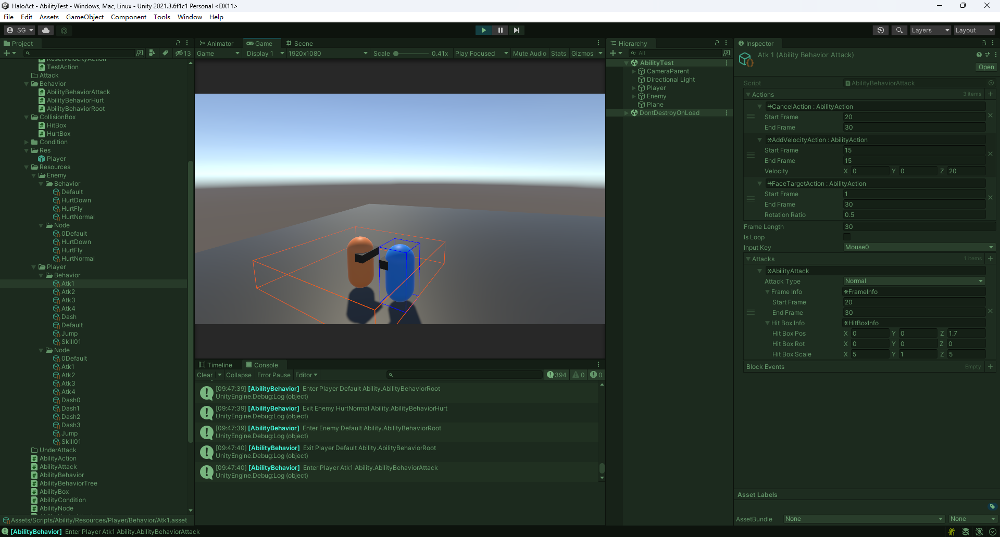

# AbilityBehaviorTree 基于帧计数的技能系统

### 支持连招派生
### 支持动态挂载各种能力
### 攻击盒和受击盒可视化
### 支持自定义能力
### 逻辑与表现分离

```
能力行为树
                                                           -> AbilityAction 
管理关系：AbilityBehaviorTree -> AbilityNode -> AbilityBehavior 
                                                           -> AbilityCondition
```


https://www.bilibili.com/video/BV1uh4y1f7ce/?spm_id_from=333.999.0.0&vd_source=7eb72ab765cd160f80bf5acc4f978ae3
